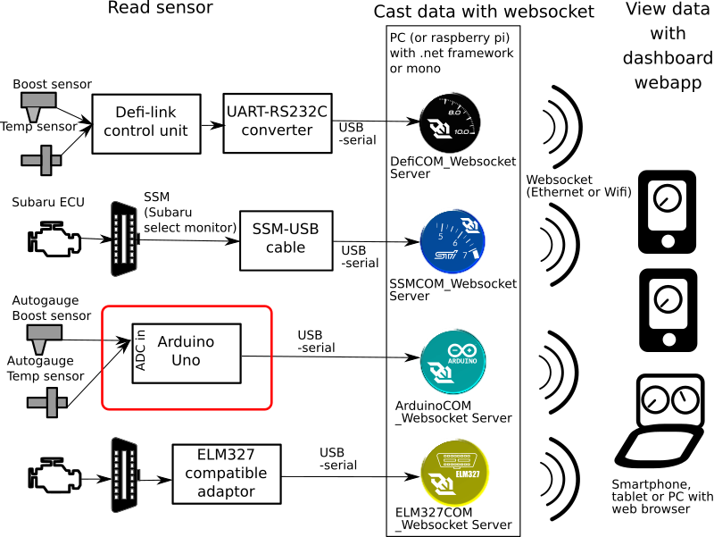
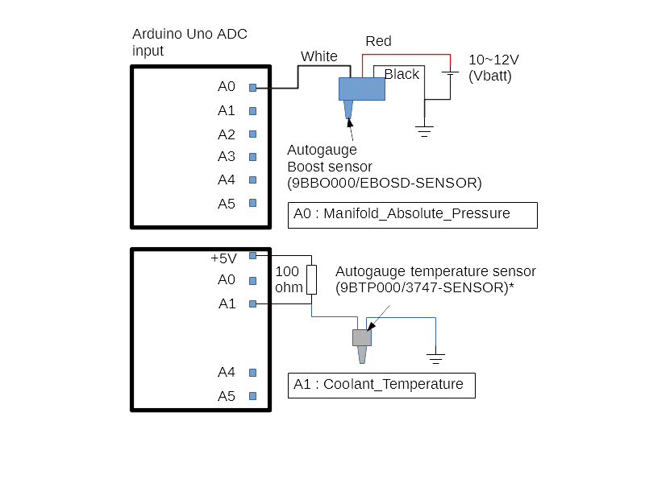
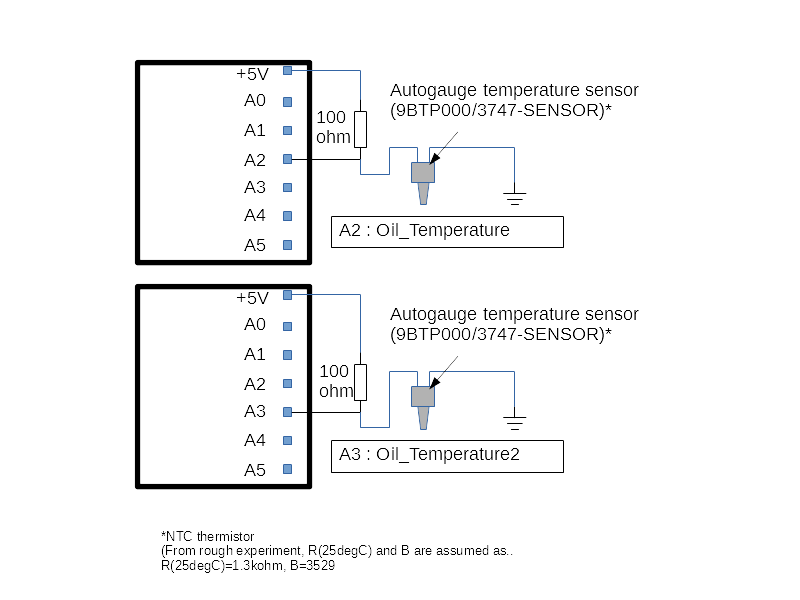
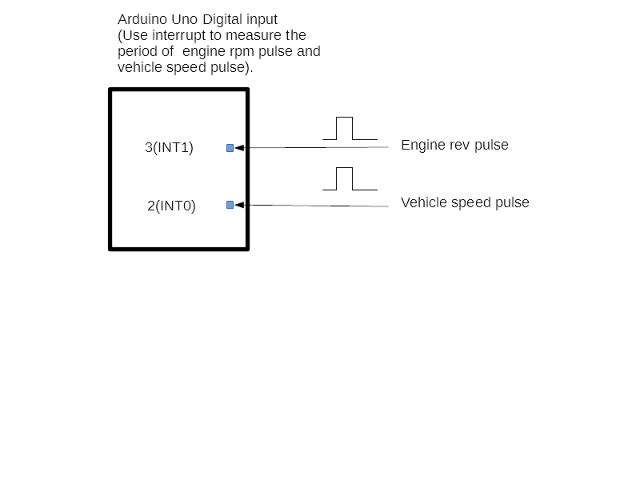

# Arduino Pulse counter / ADC reader

## Table of contents
* [Description](#description)
* [System diagram](#system_diagram)
* [Requirement](#requirement)
* [Install](#install)
* [Connect sensors](#connect_sensor)
* [Appendix](#appendix)
* [License](#license)

## <a name="description"> Description</a>
This program (arduino sketch) measure pulse interval, read ADC and send the pulse interval and ADC reading to PC via serial port (on USB).

This program can be used with [ArduinoCOM_Websocket_Server](https://github.com/sugiuraii/DefiSSMCOM_WebsocketServer).

The pulse counter/adc reader program consists of only 1 sketch file of `ArduinoTachoPulseReader/ArduinoTachoPulseReader.ino`.

(`debugTool/ArduinoTachoPulseGenerator/ArduinoTachoPulseGenerator.ino` is debug tool to generate pulse. This can bes used to check the operation of `ArduinoTachoPulseReader.ino`).

Please note that the this program simply send (speed/rev) pulse cycle time (in microsecond), and ADC reading voltage (5V=4096). Conversion from cycle/ADCreading to physical value (rpm, kPa, or degC) is done in PC-side [ArduinoCOM_Websocket_Server](https://github.com/sugiuraii/DefiSSMCOM_WebsocketServer) program.

## <a name="system_diagram"> System diagram </a>
This program correspond to the red-squared portion of following websocket dashboard gauge system diagram.



## <a name="requirement"> Requirement </a>
* Arduino UNO or compatible board.
* Arduino IDE

## <a name="install">Install</a>
Simply compile `ArduinoTachoPulseReader/ArduinoTachoPulseReader.ino` in Arduino IDE, and transfer to Arduino board.

## <a name="connect_sensor"> Connect sensors </a>
This program itself do not care about which sensors connected on Arduino analog/digital ports.
However, [ArduinoCOM_Websocket_Server](https://github.com/sugiuraii/DefiSSMCOM_WebsocketServer) program assumes sensors are connected on following ports assignment.
If you use this program with [ArduinoCOM_Websocket_Server](https://github.com/sugiuraii/DefiSSMCOM_WebsocketServer), please follow port assignment described below.

* Vehicle speed pulse : Digital port 2 (INT0)
* Engine rev pulse : Digital port 3 (INT1)
* Boost sensor : Analog input 0 (A0)
	* [ArduinoCOM_Websocket_Server](https://github.com/sugiuraii/DefiSSMCOM_WebsocketServer) assumes that Autogauge boost sensor (EBOSD-SENSOR, 9BBO000) is connected on this port.
* Water temperature sensor : Analog input 1 (A1)
* Oil temperature senosor : Analog input 2 (A2)
* Secondary Oil temperature sensor : Analog input 3 (A3)
	* [ArduinoCOM_Websocket_Server](https://github.com/sugiuraii/DefiSSMCOM_WebsocketServer) assumes that Autogauge temperature sensors (9BTP000/3747-SENSOR) are connected on these port.
* A4, A5 : Currently not assigned.





## <a name="appendix"> Appendix </a>

### Serial port data format
This program send the pulse cycle and ADC reading with follwoing format.

```
Sxxxx (xxxx -> pulse cycle on INT0(digital pin 2) in microsecond)
Txxxx (xxxx -> pulse cycle on INT1(digital pin 3) in microsecond)
Axxxx (xxxx -> ADC reding on A0 port (4096=5V))
Bxxxx (xxxx -> ADC reding on A1 port (4096=5V))
Cxxxx (xxxx -> ADC reding on A2 port (4096=5V))
Dxxxx (xxxx -> ADC reding on A3 port (4096=5V))
Exxxx (xxxx -> ADC reding on A4 port (4096=5V))
Fxxxx (xxxx -> ADC reding on A5 port (4096=5V))
Sxxxx
Txxxx
Axxxx
...
```

## <a name="license"> License </a>
[BSD 3-Clause License](./LICENSE)

