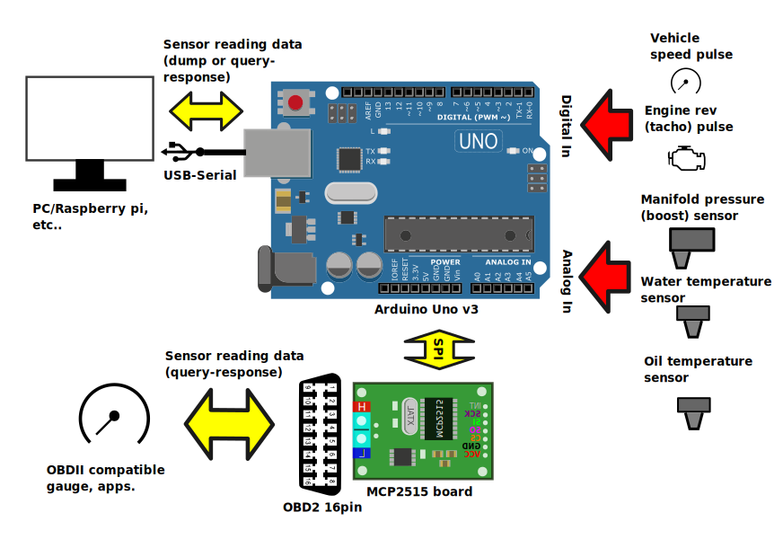
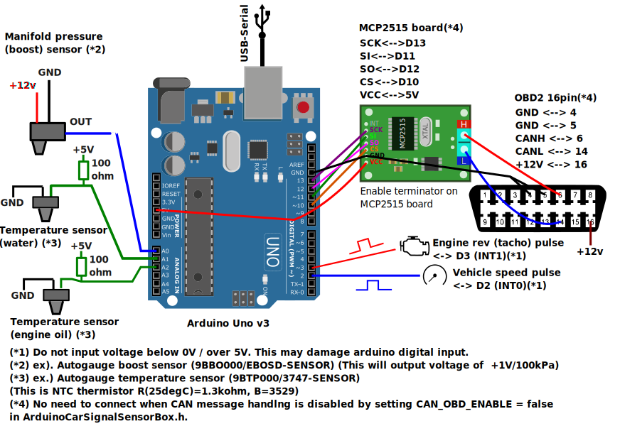

# Arduino-CarSignalSensorBox

## Table of contents
* [About](#about)
* [Demonstration](#demonstration)
* [Hardware requirement and wiring connection](#hardware)
* [Software(sketch) setup](#softsetup)
* [Communication mode](#communicationmode)
* [Dependencies](#dependencies)
* [License](#license)

## <a name="about">About</a>
This program (arduino sketch) reads automotive sensor, and send the sensor information by USB-serial port or CAN.

This program can handle following car sensor information..
* Vehicle speed pulse 
* Engine rev (tacho meter) pulse
* Turbo boost (intake manifold) pressure sensor (read sensor output by ADC).
* Engine coolant/oil temperature (read thermistor resistance by ADC)

And this program can output sensor reading data by,
* CAN with OBDII protocol
* Serial port message (by USB)
	* Dump mode (Arduino board continuously out the sensor reading data)
	* Interactive mode (Arduino board return the sensor reading data when query is received from host.)



## <a name="demonstration">Demonstration</a>
### Turbo pressure sensor reading and OBDII output (click the photo to open video)
<a href="https://github.com/sugiuraii/Arduino-CarSignalSensorBox/issues/3#issuecomment-817300218">

</a>

## <a name="hardware">Hardware requirement and wiring connection</a>
This sketch needs following hardwares.
* Arduino Uno or compatible board.
* To send the data by CAN, MCP2515 board is required.
	* MCP2515 board is not required on disabling CAN communication features. Don't forget to disable CAN feature by setting `CAN_OBD_ENABLE = false` in `ArduinoCarSignalSensorBox.h`. (otherwise, the program stops on initializing MCP2515)
* Boost pressure sensor is requred to handle turbo boost (intake manifold) pressure, 
	* Connect to A0 port.
	* Autogauge boost sensor(9BBO000/EBOSD-SENSOR) is implemented by default (This outputs voltage of 1V/100kPa). Modify `OBD2ValCovert.ino` to use other types of sensors.
		* For Autogauge sensor, connect red wire to +12V, black wire to GND, and white wire to A0 port.
* Temperature sensor is requried to handle engine coolant/oil temperature.
	* Connect to A1 (for engine coolant temperature), A2 (for engine oil temperature).
	* Autogauge temperature sensor (9BTP000/3747-SENSOR) is implemented by default.(NTC thermistor R(25degC)=1.3kohm, B=3529, connect 100ohm between sensor and +5V).
* Connect vehicle speed pulse to D2 port, to handle vehicle speed.
* Connect engine rev pulse to D3 port, to handle engine rev.
	* Do not input voltage below 0V / over 5V. This may damage arduino digital input.
	* Additional level conversion circuit is required if the pulse voltage is not 5V CMOS level.



## <a name="softsetup">Software(sketch) setup</a>
### Setup communication mode
Before compiling the sketch, check and modify `ArduinoCarSignalSensorBox/ArduinoCarSignalSensorBox.h` to set the communicationmode.

(See [Communication Mode](#communicationmode) for the detail.)
```
constexpr bool SERIAL_DUMP_ENABLE = false; // Set true to enable "Serial dump" mode.
constexpr bool SERIAL_INTERACTIVE_ENABLE = false; // Set true to enable "Serial interactive" mode.
constexpr bool CAN_OBD_ENABLE = true; // Set true to enable "CAN OBDII" mode.
```
### Install MCP2515 library
 * This step is required even if the CAN communication features is disabled by `CAN_OBD_ENABLE = false`
 * Install [Seeed-Studio/Seeed_Arduino_CAN Ver2.2.0](https://github.com/Seeed-Studio/Seeed_Arduino_CAN/archive/refs/tags/v2.2.0.zip) MCP2515 library.
    * Install zip library file on ArduinoIDE, or copy all of the contents of `src` directory (at the library zip file) to `ArduinoCarSignalSensorBox/` directory. 
### Set XTAL frequency and CAN baud rate.
 * Check and modify the argument of `CAN.begin(CAN_250KBPS, MCP_8MHZ)` in `ArduinoCarSignalSensorBox/CANMessageHandle.ino`, follwoing CAN baudrate and the frequency of XTAL of MCP2515 board.
```
void initializeCAN()
{
  bool initSucess = false;
  while (!initSucess)
  {
    if (CAN_OK == CAN.begin(CAN_250KBPS, MCP_8MHz)) // XTAL = 8MHz: baudrate = 250k
    {
      Serial.println(F("CAN BUS Shield init ok!"));
      initSucess = true;
    }
    else
    {
      Serial.println(F("CAN BUS Shield init fail"));
      Serial.println(F("Init CAN BUS Shield again"));
      delay(100);
      initSucess = false;
    }
  }
```
### Compile
Open `ArduinoCarSignalSensorBox/ArduinoCarSignalSensorBox.ino` and compile it.

## <a name="communicationmode">Communication mode</a>
* ### CAN OBDII mode
	* This mode return the sensor reading data by OBDII PID query.
	* Following PIDs are supported.
		* PID 0x05 = Engine coolant temperature
		* PID 0x0B = Manofold absoulte pressure
		* PID 0x0C = Engine speed (rpm)
		* PID 0x0D = Vehicle speeds
		* PID 0x5C = Engine oil temperature

	* On this mode, (USB-)serial port is used to check debug or error message.

* ### Serial interactive mode
	* This mode return the sensor reading data by the query command from host.
	* The query command is single character (see `ArduinoCarSignalSensorBox/SerialPortInteractive.ino`).
		* 'T': Return engine rev in rpm.
        * 'S': Return vehicle speed in km/h.
        * 'B': Return manifold absolute pressure in kPa.
        * 'W': Return engine colant tempeture in degC.
        * 'O': Return engine oil temperature in degC.
        * '0' to '6': Return ADC input level (0 to 4096) of arduino A0 to A6 input.
* ### Serial dump mode
	* In this mode, sensor reading data are continously dumped to serial port. (no query is needed)
	* This mode is suitable for rapid commuinication between host and arduino board.
	* **On this mode, pulse cycle time (for vehicle speed/engine rev) and ADC reading level are sent instead of physical value (rpm, km/h, degC...).**
		* **Conversion functions (to physical values) needs to be implemented in host(PC) side program.**
		* Dump output data format
			```
			Sxxxx (xxxx -> pulse cycle on INT0(digital pin 2) in microsecond)
			Txxxx (xxxx -> pulse cycle on INT1(digital pin 3) in microsecond)
			Axxxx (xxxx -> ADC reding on A0 port (4096=5V))
			Bxxxx (xxxx -> ADC reding on A1 port (4096=5V))
			Cxxxx (xxxx -> ADC reding on A2 port (4096=5V))
			Dxxxx (xxxx -> ADC reding on A3 port (4096=5V))
			Exxxx (xxxx -> ADC reding on A4 port (4096=5V))
			Fxxxx (xxxx -> ADC reding on A5 port (4096=5V))
			Sxxxx
			Txxxx
			Axxxx
			...
			```

## <a name="dependencies">Dependencies</a>
*  [Seeed-Studio/Seeed_Arduino_CAN](https://github.com/Seeed-Studio/Seeed_Arduino_CAN/) 

## <a name="license"> License </a>
[BSD 3-Clause License](./LICENSE)

